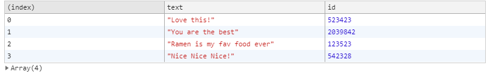

### day 7: Array Cardio Day 2

day 7에서는 Array의 method인 some, every, find, findIndex를 사용해 보았다.

주어진 데이터는 다음과 같다.

```js
const people = [
  { name: 'Wes', year: 1988 },
  { name: 'Kait', year: 1986 },
  { name: 'Irv', year: 1970 },
  { name: 'Lux', year: 2015 },
]

const comments = [
  { text: 'Love this!', id: 523423 },
  { text: 'Super good', id: 823423 },
  { text: 'You are the best', id: 2039842 },
  { text: 'Ramen is my fav food ever', id: 123523 },
  { text: 'Nice Nice Nice!', id: 542328 },
]
```

#### 1. some()을 통해 19살 이상인 사람이 있는지 찾기

```js
// Some and Every Checks
// Array.prototype.some() // is at least one person 19 or older?

const isAdult = people.some(
  person => new Date().getFullYear() - person.year >= 19
)
console.log(isAdult) // true
```

some()은 배열의 요소중 하나라도 조건을 만족한다면(true를 반환한다면)
최종 값이 true가 되고 이 외의 경우에는 false가 반환된다.

#### 2. every()를 통해 모두 19살 이상인지 확인하기

```js
// Array.prototype.every() // is everyone 19 or older?

const isAllAdult = people.every(
  person => new Date().getFullYear() - person.year >= 19
)
console.log(isAllAdult) //false
```

every()는 배열의 모든 요소가 조건을 만족한다면(true를 반환한다면)
최종 값이 true가 되고 이 외의 경우에는 false가 반환된다.

#### 3. find()를 통해 조건을 만족하는 요소 찾기

```js
// Array.prototype.find()
// Find is like filter, but instead returns just the one you are looking for
// find the comment with the ID of 823423

const res = comments.find(comment => comment.id === 823423)
console.log(res) // {text: "Super good", id: 823423}
```

find()를 통해 조건을 만족하는 요소를 찾을 수 있다.
filter()와 유사하지만 find()는 앞에서부터 해당 조건이 만족하는 하나의 요소를 찾으면 해당요소를 반환하고 종료된다.

#### 4. findIndex()를 통해 조건을 만족하는 요소 찾고 삭제하기

```js
// Array.prototype.findIndex()
// Find the comment with this ID
// delete the comment with the ID of 823423

const idx = comments.findIndex(comment => comment.id === 823423)
console.log(idx) // 1

const newComments = [...comments.slice(0, idx), ...comments.slice(idx + 1)]
console.table(newComments)
comments.splice(idx, 1)
console.table(comments)
```

findIndex()를 이용하면 조건을 만족하는 요소의 index가 반환된다.
splice를 이용하여 해당 index의 요소를 삭제해 줄수도 있고
spread Opreator를 이용하여 새로운 배열을 만들 수도 있다.

##### spread Opreator: 말그대로 반복 가능한 요소를 전개하여 사용할 수 있게 해주는 연산자이다.

삭제 결과


