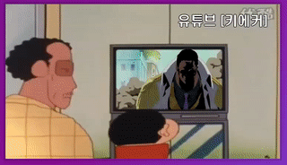

### day 11: Custom Video Player

day 11에서는 Video Player를 꾸며보았다.



- 비디오의 시간에 따라 변화하는 progressbar
- 일시중지와 재생을 toggle 할 수 있는 버튼
- 볼륨 input
- Skip 버튼


```css
.player__controls {
  display: flex;
  position: absolute;
  bottom: 0;
  width: 100%;
  transform: translateY(100%);
  transition: all 0.3s;
  flex-wrap: wrap;
  background: rgba(0, 0, 0, 0.1);
}

.player:hover .player__controls {
  transform: translateY(0);
}

```

전체 컨트롤 기능들은 css의 transform을 이용하여 hover상태일 때에만 노출된다.

#### progressbar


영상의 진행 시간과 바의 너비가 같아야 하므로 video의 property인 currentTime과 duration을 이용한다.

currentTime은 현재 진행시간, duration은 전체 영상길이 값을 갖는다.

이를이용해 flex-basis값으로 너비를 설정해주는 방식을 사용하였다.

```js
function updateProgress() {
  const progressPercent = (video.currentTime / video.duration) * 100;
  progressBar.style.flexBasis = `${progressPercent}%`;
}
```
위 함수는 video에 timeupdate 이벤트 리스너를 추가하여 동작할 수 있도록한다.

```js
video.addEventListener('timeupdate', updateProgress);
```


```js
function updateTime(e) {
  const time = (e.offsetX / progress.offsetWidth) * video.duration;
  video.currentTime = time;
}
```
또한 progressbar를 클릭 했을때 progressbar의 넓이와 마우스의 위치좌표의 비율을 계산하여 영상의 현재 시간을 조절한다.

```js
let mouseDown = false;
progress.addEventListener('click', updateTime);
progress.addEventListener('mousemove', (e) => mouseDown && updateTime(e));
progress.addEventListener('mousedown', () => (mouseDown = true));
progress.addEventListener('mouseup', () => (mouseDown = false));

```

이를 이용하여 영상시간을 조절할 수 있고, progressbar의 색상은 영상의 현재 시간이 바뀌었기 때문에 이전의 updateProgress가 자동적으로 처리된다.


#### 재생, 정지 toggle

```js
function togglePlay() {
  const method = video.paused ? 'play' : 'pause';
  video[method]();
}

```
영상의 재생과 정지를 toggle하기 위해 
video의 play(), pause() method를 이용한다.

```js
video.addEventListener('click', togglePlay);

toggle.addEventListener('click', togglePlay);
```

위의 콜백함수는 video와 button에 click 이벤트 리스너를 추가하여 동작시킨다.

#### 볼륨 input

```js
function handleRangeUpdate() {
  video[this.name] = this.value;
}
```

html의 input에 미리 설정된 name을 이용하여
video의 property값을 value에 맞게 바꾸어 줄 수 있다.

```js
ranges.forEach((range) => range.addEventListener('change', handleRangeUpdate));
ranges.forEach((range) => range.addEventListener('mousemove', handleRangeUpdate));
```

드래그에 따라 처리하기 위해서 change와 mouseover 이벤트 리스너를 추가한다.


#### Skip 버튼

이전의 updateTime 함수와 비슷하다.
영상의 현재시간 속성값에 내가 지정한 임의의 시간을 추가하거나 빼주면 된다.


```html
<button data-skip="-10" class="player__button">« 10s</button>

<button data-skip="10" class="player__button">10s »</button>

```

```js
function handleSkip() {
  const time = video.currentTime + parseInt(this.dataset.skip);
  video.currentTime = time;
}
```

html에서 'data-?'로 지정한 attribute 값은 해당 dom의 dom.dataset.?을 통해 가져올 수 있다.


