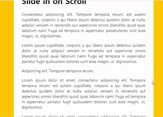

### day 13: Slide in on Scroll

day 13에서는 scroll을 감지하여 스크롤의 위치에 따라 이미지가 나타났다 사라지는 효과를 만들어보았다.



이때 조금만 스크롤을 내려도 많은 이벤트가 발생하기 때문에 성능 상의 문제가 발생할 수 있다.


#### debounce: 연속적으로 이벤트가 발생할때 매 순간 함수를 호출하지 않고 이벤트가 끝났을 때 함수를 호출하는 기법

```js
function debounce(func, wait = 20) {
  let timeout;
  return function () {
    let args = arguments;
    if (timeout) {
      clearTimeout(timeout);
    }
    timeout = setTimeout(() => {
      func(args);
    }, wait);
  };
}


window.addEventListener('scroll', debounce(checkSlide));
```

arguments는 함수에 전달받은 파라미터들을 나타낸다.
콜백함수로 실행되면 Event와 함수를 호출한 callee, iterator정보를 갖게된다.

scroll이벤트가 발생할 때마다 debounce처리 된 function()이 호출된다.
setTimeout을 통해 wait만큼의 대기시간(ms)가 발생하면 전달받은 함수가 실행된다.
하지만 연속적으로 scroll이벤트가 발생할 때에는 clearTimeout에 의해 해당 setTimeout함수가 취소되므로 마지막 scroll이벤트가 발생하고 일정시간 후 checkSlide함수가 동작하게 된다.

#### throttle: 함수가 호출된 후 일정시간동안 호출되지 않도록 하는 것

```js
function throttle(func, wait = 20) {
  let timeout;
  return function () {
    let args = arguments;
    if (!timeout) {
      timeout = setTimeout(() => {
        timeout = null;
        func(args);
      }, wait);
    }
  };
}


window.addEventListener('scroll', throttle(checkSlide));
```


scroll이벤트가 발생할 때마다 throttle처리 된 function()이 호출된다.
setTimeout을 통해 wait만큼의 대기시간(ms)가 발생하면 전달받은 함수가 실행된다.
setTimeout을 실행한 순간 즉각적으로 setTimeout의 id값이 timeout값으로 반환한다. 
setTimeout함수 내부에 있는 함수는 wait시간을 기다린 후 timeout을 null로 바꾸어 준다.

따라서 wait시간을 기준으로 함수의 반복호출을 막을 수 있다.


##### debounce를 이용하여 스크롤을 처리할때에는 스크롤을 멈추지 않는경우 함수가 동작하지 않을 수 있다.

##### throttle을 이용할 때에는 debounce보다 더 많은 콜백함수의 실행을 발생시킬 수 있다.


```js
const sliderImages = document.querySelectorAll('.slide-in');
function checkSlide(e) {
  sliderImages.forEach((sliderImage) => {
    const SlideInAt = window.scrollY + window.innerHeight - sliderImage.height / 2;
    const imageBottom = sliderImage.offsetTop + sliderImage.height;
    const isHalfShown = SlideInAt > sliderImage.offsetTop;
    const isNotScrolledPast = window.scrollY < imageBottom;
    if (isHalfShown && isNotScrolledPast) {
      sliderImage.classList.add('active');
    } else {
      sliderImage.classList.remove('active');
    }
  });
}

```

위의 결과물을 만들어 내기 위해서 각각의 slide에 대한 dom에 접근하여, 
scrollY값과 image의 좌표를 비교하여 classList의 추가 삭제를 통한 Slide를 구현하였다.

