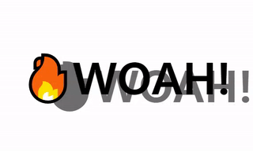

### day 16: Text Shadow Mouse Move Effect

day 16에서는 마우스 위치를 이용하여 h1태그의 textShadow값을 변화 시켜 보았다.

h1을 포함하는 div에 mousemove 이벤트 리스너를 추가하고 발생하는 event의 offsetX, offsetY 값을 이용하였다.

```js
hero.addEventListener('mousemove', throttle(handleMousemove));
```

마우스 커서가 h1을 포함하는 div에 있을때와 h1에 있을때 offsetX, offsetY좌표는 다르다.


```js
function handleMousemove(event) {
  const { offsetWidth: width, offsetHeight: height } = hero;
  let { offsetX: x, offsetY: y } = event;

  if (this !== event.target) {
    x += event.target.offsetLeft;
    y += event.target.offsetTop;
  }
  x = Math.round((x / width) * 100) - 50;
  y = Math.round((y / height) * 100) - 50;

  text.style.textShadow = `${x}px ${y}px 0 rgba(111,111,111)`;
}
```
event가 발생하는 target의 element 기준으로 좌표가 바뀌기 때문이다.
따라서 h1태그 위에 마우스 포인트가 존재할때에는 offsetLeft와 offsetTop값을 이용하여 부모요소와의 거리를 추가적으로 더해주었다.


또한 mousemove이벤트의 빈도를 줄이기 위해 13day에서 배운 throttle을 이용하였다.
```js
function throttle(func, wait = 30) {
  let timeout;
  return function () {
    let args = arguments;
    if (!timeout) {
      timeout = setTimeout(
        function () {
          timeout = null;
          func.call(this, args[0]);
        }.bind(this),
        wait
      );
    }
  };
}
```
또한 this는 setTimeout을 이용한 throttle에서 window가 되기 때문에
setTimeout에 전달하는 함수를 bind해 주었다.

그다음 throttle에 전달된 함수를 call을 이용하여 this와 연결한 후 호출하면 callback함수에서 this객체를 window가 아닌 이벤트가 추가된 객체로 설정할 수 있다.

---
또는 arrow function을 이용하여 lexical context인 element를 this로 사용할 수 있다.

```js
function throttle(func, wait = 30) {
  let timeout;
  return function () {
    let args = arguments;
    if (!timeout) {
      timeout = setTimeout(() => {
        timeout = null;
        func.call(this, args[0]);
      }, wait);
    }
  };
}


```


#### 결과화면
