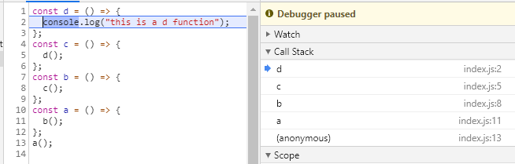
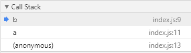
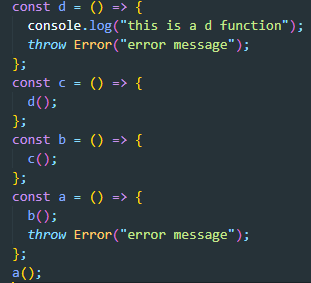
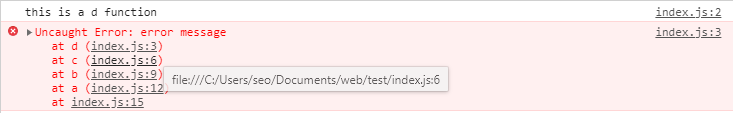

### Call Stack

- 자바스크립트가 함수 실행을 다루는 방법
- 호출된 함수를 Stack에 쌓고 위에서부터 실행되고 종료된 후 사라진다.
- 에러가 발생했을 때, 에러메시지는 에러 발생 직전의 Call Stack을 보여줌

```javascript
const d = () => {
  console.log("this is a d function");
};
const c = () => {
  d();
};
const b = () => {
  c();
};
const a = () => {
  b();
};
a();
```

위의 코드와 같이 함수 4개를 정의하고 a()를 호출하게되면
stack에 d c b a 순서로 쌓이는 것을 볼 수 있다.


  
개발자 도구의 Sources 탭을 확인하면 Call Stack을 확인할 수 있다.



코드를 계속 해서 진행시키면 각각의 함수가 실행되고 실행이 종료된 이후에, Call stack에서 차례대로 사라지는 것을 볼 수 있다.

만약에 코드가 진행중에 에러가 발생하면 어떻게 될까??


에러 메시지는 에러 발생이전의 Call Stack을 보여준다.


Call Stack을 통해 자바스크립트가 어떻게 `동기적`으로 실행되는지를 알 수 있다.