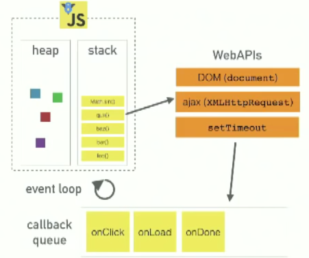

### 자바스크립트 동작

- asyncronous
- single-thread

### Event loop
- Call Stack
- Web API
- Task Queue



[블로그 링크](https://medium.com/front-end-weekly/javascript-event-loop-explained-4cd26af121d4)


실행된 code는 CallStack에 push된다.
CallStack에 쌓인 code가 실행될 때 WebAPI가 제공하는 DOM, ajax, setTimeout등 (비동기로 처리되는 함수)을 사용한다면 web Api는 백그라운드에서 코드를 처리후에 Task Queue에 콜백을 추가한다.
Task Queue에 있는 콜백은 Call Stack이 비어있는 상태가 될 떄 까지 기다렸다가 Call Stack에 추가된다.

이후 실행이 종료된후 Call Stack에서 사라진다.

```javascript
setTimeout(() => {
  console.log("hello");
}, 1000); //delay >= 1000ms
```

따라서 위와 같은 code를 실행하였을 때 최소 delay인 1000ms는 web Api에서 보장되지만, Task queue에서 Call Stack이 비어있을때 까지 기다려야하므로, 추가적인 delay가 발생할 수 있다.

### 정리

- 백그라운드와 Task Queue는 자바스크립트로 이루어져 있지않다.
-  JS Engine이 백그라운드와 Task Queue를 처리해주기 때문에 여러가지 일을 동시에 `(multi thread)` 처리할 수 있어 비동기 처리가 가능하다.

- 자바스크립트 자체는 `single-thread`라는 특성을 갖고 있다.

---
### 결론
`Event Loop`에 의해 자바스크립트는 `비동기적`이면서 `싱글 쓰레드`로 동작한다는 것을 이해할 수 있다.