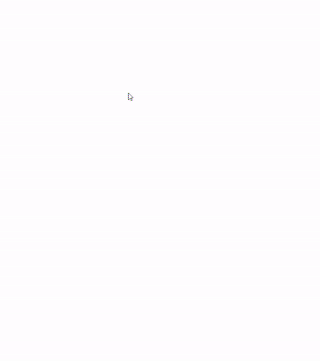

### day 8: HTML 5 Canvas

day 8에서는 canvas를 이용하여 화면에 그림을 그려보았다.

```html
<canvas id="draw" width="800" height="800"></canvas>
```

```js
const canvas = document.getElementById('draw')
const ctx = canvas.getContext('2d')
```

[MDN: Canvas](https://developer.mozilla.org/en-US/docs/Web/API/Canvas_API)
canvas element에 접근하여 getContext()를 실행하면 렌더링할 수 있는 method에 접근할 수 있다.

위에서 2d옵션을 이용하면 CanvasRenderingContext2D 인터페이스를 사용할 수 있다.
[MDN: CanvasRenderingContext2D](https://developer.mozilla.org/ko/docs/Web/API/CanvasRenderingContext2D)

CanvasRenderingContext2D의 lineCap, lineJoin, strokeStyle,lineWidth라는 propery 값을 변경해보고 beginPath(),moveTo(),lineTo(),stroke() method를 이용하여 그림을 그려보았다.

```js
ctx.lineCap = 'round'
ctx.lineJoin = 'miter'
```

lineCap은 직선의 끝부분의 모양, lineJoin은 꺾이는 부분의 모양을 설정해 줄 수 있고, strokeStyle을 통해 색상, lineWidth로 두께를 결정해 줄 수 있다.

beginPath()를 호출할 때 마다 새로운 직선을 그릴 수 있고, moveTo와 lineTo를 이용해 시작지점과 끝지점을 설정한 후 stroke()를 통해 화면에 나타내게 된다.

마우스의 움직임을 통해 화면에 그려주기 위해서 먼저 window에 이벤트 핸들러를 추가한다.

```js

window.addEventListener('mousemove', e => {
  if (isDrawing) {
    draw(e)
  }
})

window.addEventListener('mousedown', e => {
  [x, y] = [e.offsetX, e.offsetY]
  isDrawing = true
})

window.addEventListener('mouseup', () => {
  isDrawing = false
})
```

마우스를 드래그 할때 그려주기 위해서 isDrawing 이라는 변수를 통해 상태를 파악한다.

또 클릭시점의 좌표를 저장하고, mousemove가 발생할 때 마다 offsetX, offsetY를 x,y로 저장하였다.

이를 이용해 마우스 버튼을 누른상태에서 움직일 때마다 직선들이 그려질 수 있도록 하였다.

```js
function draw(e) {
  ctx.strokeStyle = `hsl(${color},100%,50%)`;
  ctx.beginPath();
  ctx.moveTo(x, y);
  [x, y] = [e.offsetX, e.offsetY];
  ctx.lineTo(x, y);
  ctx.stroke();
}
```

많은 직선이 짧은 시간안에 그려지기 때문에 자연스러운 곡선을 그릴 수 있다.

color값과 lineWidth값을 계속 바꿔주어 효과를 넣어보았다.

##### 결과 화면

