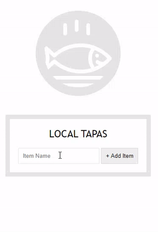

### day 15: LocalStorage

day 15에서는 localStorage를 이용해서 데이터를 저장하고
화면에 리스트로 보여주었다.

#### localStorage: HTML5에 추가된 저장소로 데이터가 영구적으로 브라우저에 저장된다.

반대로 sessionStorage는 브라우저를 종료하면 데이터가 사라진다.
따라서 데이터를 localStorage에 저장하여 이전에 만들었던 리스트를 그대로 가져올 수 있을것이다.

또 Storage는 쿠키보다 용량이 더 크고 서버에 전송되지 않는 특징이 있다.


```js
const items = JSON.parse(localStorage.getItem('items')) || [];
```
localStorage에서 데이터를 가져온다. 데이터가 없는경우 빈 array가 된다.


```js
function addItem(e) {
  e.preventDefault();
  const text = this.querySelector('[name=item]').value;
  const item = {
    text,
    done: false,
  };

  items.push(item);
  populateList(items, itemsList);
  localStorage.setItem('items', JSON.stringify(items));
  this.reset();
}
```
데이터를 입력하고 추가하면 localStorage에 아이템이 추가된다.
localStorage에 저장되는 데이터는 String이기 때문에, 저장할 Object를 String으로 바꾸어준다.


populateList함수는 저장된 데이터를 기반으로 리스트 목록을 만들어낸다.
```js
function populateList(plates = [], platesList) {
  platesList.innerHTML = plates
    .map((plate, i) => {
      return `
      <li>
        <input type="checkbox" data-index=${i} id="item${i}" ${plate.done ? 'checked' : ''}/>
        <label for="item${i}">${plate.text}</label>
      </li>
    `;
    })
    .join('');
}
```

```js
function toggleDone(e) {
  if (!e.target.matches('input')) return;
  const el = e.target;
  const index = el.dataset.index;
  items[index].done = !items[index].done;
  localStorage.setItem('items', JSON.stringify(items));
  populateList(items, itemsList);
}
```
toggleDone함수로 리스트의 input태그들의 checked상태에 대한 정보를 true 또는 flase로 저장한다.

```js
populateList(items, itemsList);
addItems.addEventListener('submit', addItem);
itemsList.addEventListener('click', toggleDone);

```
기본적으로 populateList를 한번 호출하여 초기상태를 보여주고,
추가버튼과, form에 이벤트 리스너를 추가해준다.

결과화면


새로고침을 해도 데이터가 저장되어있는 것을 확인할 수 있다.