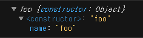

우아한 테크 코스 1주차 - 2


### JS / Redux


자바스크립트 함수는 값을 반환하게 되어있음 함수는 값이다

return 없으면 undefined반환

```js
function foo() {}

console.log(new foo());
```


new 연산자로 함수 호출 하면 명시적 return이 없어도 새로운 객체를 만들어낸다.
```js

const bar = function bar() {
  bar();
};
```
`함수식` 

bar() 는 const bar을 가리키기 때문에 
안에있는 function에 이름을 붙일 필요 없음
```js
const bar = function () {

};
```
함수를 값으로 취급할 때에는 이름이 필요없음
```js
(function(){

})
```
자바스크립트 엔진에게 함수를 값으로 취급함을 알려줌
```js

(function(){

})() // immediately invoked function call
```
즉시 실행 가능 (프로그램 상에서 단 1번만 호출되는 함수 필요할 때)
```js
function foo(x) {
  x();
  return function() {

  };
}

const y = foo(function() {

})


```
입력을 함수로 받고 함수로 반환
higher order function

입력을 컴포넌트 출력을 컴포넌트
higher order component


```js
const foo = function foo() {
  foo()
}
```
재귀 호출을 위해 함수 이름을 생략하지 않는 경우도 있음

```js
const bar = () => {
  return 
}
```
모든 자바스크립트 코드는 `식` 또는 `문`이다.

결과가 값으로 마무리되면 식 
ex) 1 + 10;

값이 안나오는 것은 문

ex) 조건문
if () {}

while() {}

```js

const x = 10;
const y = () => 10;

console.log(x, y(), y``); // 10 10 10
```
##### primitive type: 객체가 아니면서 메서드도 가지지 않는 데이터 타입
- Boolean
- Null
- Undefined
- Number
- Bigint
- String
- Symbol

```js
var bar = "baz";
console.log(bar);        // baz
bar.toUpperCase();
console.log(bar);        // baz
```
불변하여 변형할 수 없다는 특징이 있다.


##### instanceof
```js
if (y instanceof foo){
  
} 
```

객체를 만들 수 있는 인증 함수 foo를 위임하여 확인

y가 foo로 만들 수 있는 객체인지 확인
모든 객체 대상으로 확인하기 힘들기 때문에 

```js
function foo() {
  this.name = 10;
}

class bar {
  constructor() {
    this.name = 10;
  }
} // 명시적이다

console.log(foo())
console.log(new foo())
console.log(new bar())
// 같은 결과
```

##### 실행 컨텍스트(execution context)
누가 실행했는지, 누가 소유했는지
```js
const person = {
  name: '김민태',
  getName() {
    return this.name;
  }
}
console.log(person.getName())
여기서 호출 순간의 소유자 => person

const man = person.getName;
console.log(man()) // cannot read property 'name' of undefined
man의 소유자인 this는 window객체가 되기 때문
```
```js
button.addEventLisnter('click', person.getName) // cannot read property 'name' of undefined
this는 콜백을 실행하는 button이 된다.
```
자바스크립트에서 this는 호출시기에 누가 호출했는지에 따라 바뀌기 때문에
많은 버그가 발생할 수 있다.

this를 고정시키기위해 bind사용 (call, apply도 가능)


button.addEventLisnter('click', person.getName.bind(person)) 
bind를 이용하여 this를 person으로 고정시킬 수 있다.

arrow function을 이용하면 lexical context에 따라 this가 결정되어 바뀌지 않는다.

##### closer

```js
const person = {
  age: 10,
}
person.age = 500;
```
위의 person객체는 age값에 직접 접근 가능하다

persone.age를 접근하지 못하도록 클로저를 이용한 해결 방법 예시
```js
function makePerson() {
  let age = 10;
  return {
    getAge() {
      return age;
    },
    setAge(x) {
      age = x > 1 && x < 130 ? x : age;
    }
  }
}
let p = makePerson();

console.log(p.getAge()) // 10 
```

#### 비동기

```js

setTimeout(function (x) {
  console.log('앗싸')
  setTimeout(function(y) {
    console.log('웃싸')
  }, 2000)
}, 1000);
```

Promise 
```js
const p1 = new Promise((resolve, reject) => {
  setTimeout(()=> {
    resolve('응답');
  }, 1000)
});

const p2 = new Promise((resolve, reject) => {
  setTimeout(()=> {
    resolve('응답2');
  }, 1000)
});


p1.then(p1)
  .then(p2)
  .catch(function () {})
```
resolve()가 호출되면 then에 입력된 콜백함수가 실행
reject()가 호출되면 catch에 입력된 콜백함수가 실행

비동기 함수
```js
async function main() {
  console.log('1');
  console.log('2');
}

main();
```
1과 2 출력사이에 3초의 딜레이를 주려면?
```js

const delay = ms => new Promise(resolve => setTimeout(resolve, ms))

async function main() {
  console.log('1');
  try {
    await delay(2000);
  } catch(e) {
    console.error(e)
  }
  console.log('2');
}

```
await는 resolve함수가 호출되었을 때 값이 return 됨

### Redux 

여러 컴포넌트가 필요한 데이터를 전역 저장소에서 다 뿌려주자

원래는 값이 하나 바뀌면 모든 컴포넌트가 다 새로 그려지는 문제점이 있다.

리액트는 JSX 를 Virtual DOM으로 만들고 기존 DOM과 비교하여 다른 부분만 바꿔줄 수 있음

이를 이용하여 모든 컴포넌트를 다 새로 그릴 필요 없이 전역 저장소에서 데이터를 뿌려줄 수 있게 되었다.

index.js
```js
import { createStore } from "./redux";
const INCREMENT = "increment";
const RESET = "reset";

function reducer(state = {}, action) {
  switch (action.type) {
    case INCREMENT:
      return { ...state, count: state.count ? state.count + 1 : 1 };
    case RESET:
      return { ...state, count: action.resetCount };
    default:
      return state;
  }
}

const store = createStore(reducer);

function update() {
  console.log(store.getState());
}

function actionCreator(type, data) {
  return {
    ...data,
    type
  };
}

function increment() {
  store.dispatch(actionCreator(INCREMENT));
}

function reset() {
  store.dispatch(actionCreator(RESET, { resetCount: 10 }));
}

store.subscribe(update);
store.dispatch({ type: INCREMENT})        // {count: 1}
store.dispatch(actionCreator(INCREMENT))  // {count: 2} 같은 결과
increment();                              // {count: 3} 같은 결과
reset();  // {count: 10}
```

redux.js
```js
export function createStore(reducer) {
  let state = {};
  let listeners = [];
  const getState = () => ({ ...state });
  const dispatch = (action) => {
    state = reducer(state, action);
    listeners.forEach((fn) => fn());  
    //  dispatch를 실행할 때 마다 subscribe로 전달한 함수 실행
  };

  const subscribe = (fn) => {
    listeners = [...listeners, fn];
  };

  return {
    getState,
    dispatch,
    subscribe
  };
}
