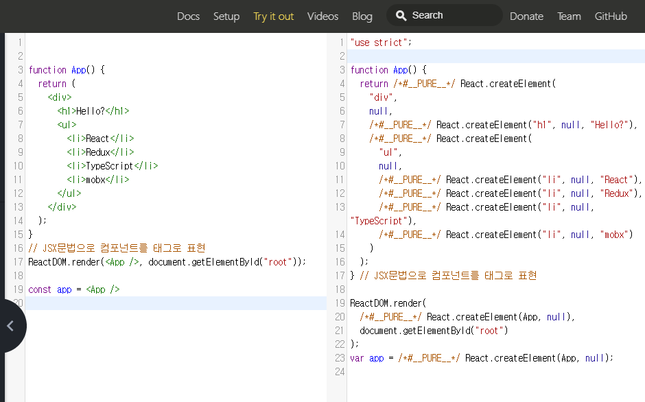
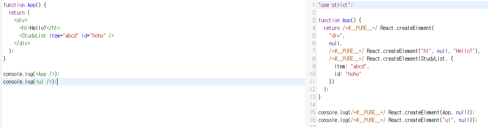

우아한 테크 코스 2주차 - 1

### React 직접 구현하기

- 사용자에만 머무르지 말자
- 지식을 넓히자

real dom을 통해 ui를 조작하는 것은 안정성이 떨어진다 + low level

#### React: dom을 좀 더 다루기 쉽게 하기 위해 만들어진 Concept

HTML을 DOM Tree로 converting해서 조금 더 다루기 쉽게 하는 것과
DOM을 VDOM <-> JS 관계를 이용해 쉽게 다루는 것은 유사한 Concept이다.



위의 이미지는 React의 코드와 Babel을 통해 transpile된 코드를 보여준다.
React에서 사용되는 JSX들은 컴파일 time에 babel에 의해 트랜스파일된다.
우측의 결과를 보면 JSX들은 런타임에 React.createElement라는 함수를 통해 V dom을 생성한다는 것을 알 수 있다.

컴파일 타임인지 런타임인지 구별하자!

babel이 트랜스파일링할때(컴파일 할때) 소문자와 대문자의 처리방식이 다름
대문자는 함수로 생각 태그 내임은 함수, property들은 2번째 인자로 함수에 전달됨, 하위요소는 child요소

```js
/* @jsx createElement */


```
React를 import하지 않아도 이 주석을 통해 JSX코드들은 createElement함수로 babel을 통해 transpile되도록 지정해 줄 수 있다.
jsx들은 compile time에 createElement로 바뀐다.
=> runtime과 compile time을 구별하자

직접 createElement를 구현해보자

```js
function createElement(type, props = {}, ...children) {
  if (typeof type === "function") {
    return type.apply(null, [props, ...children]);
  }
  return { type, props, children };
}

```
JSX들은 compile time에 babel에 의해 createElement함수로 변환되고
JSX의 tag Name이 type, 프토퍼티들이 props, 자식 요소들이 배열로 전달된다.


이때 tag name이 소문자라면 string으로 전달되고, 대문자라면 function으로 구별되어 전달된다. 즉 대 소문자의 tag name작성을 통해 컴포넌트와 HTML element을 구별해준다.

type이 function이라면 apply를 통해 해당 함수를 실행한다. 이때 파라미터로 context 값은 null, 자식요소들 또한 파라미터로 전달한다.

type이 function이 아니라면, 객체를 반환한다.
반환된 객체인 vdom은 다음과 같은 형식일 것이다.

```js
const vdom = {
  type: "ul",
  props: {},
  children: [
    { type: "li", props: { className: "item" }, children: "React" },
    { type: "li", props: { className: "item" }, children: "Redux" },
    { type: "li", props: { className: "item" }, children: "TypeScript" },
    { type: "li", props: { className: "item" }, children: "mobx" }
  ]
};

```


render 함수를 만들어 보자

우리는 만들었던 v dom을 실제 dom으로 만들어 줄 것이다.

```js
function render(vdom, container) {
  // v dom, new v dom 비교해서 다른 부분만 바뀌게함 (diff algorithm)
  container.appendChild(renderElement(vdom));
}
```
render라는 함수는 container에 v dom을 붙여줄 것이다.
이 때 real dom과 v dom의 차이점을 찾고 수정하는 diff algorithm이 적용된다.

이후 real dom과 다른 v dom을 실제 HTML element로 만들어 주어야한다.

```js
function renderElement(node) {
  if (typeof node === "string") {
    return document.createTextNode(node);
  }
  const el = document.createElement(node.type);
  node.children.map(renderElement).forEach((element) => {
    el.appendChild(element);
  });
  return el;
}
```
renderElement를 통해 재귀적으로 HTML element를 트리구조로 만들어 줄 수 있다.
재귀적으로 만들어진 HTML element는 부모에 붙고 최종적으로 container에 붙는다.

위의 코드는 안전한 방식이 아니지만 예시를 들기위해 작성된 코드이다.

```js

/* @jsx createElement */

function renderElement(node) {
  if (typeof node === "string") {
    return document.createTextNode(node);
  }
  const el = document.createElement(node.type);
  node.children.map(renderElement).forEach((element) => {
    el.appendChild(element);
  });
  return el;
}

function render(vdom, container) {
  // v dom vs new V dom 비교해서 다른 부분만 바뀌게함 (diff algorithm)
  container.appendChild(renderElement(vdom));
}

function createElement(type, props = {}, ...children) {
  if (typeof type === "function") {
    return type.apply(null, [props, ...children]);
  }
  return { type, props, children };
}

function Row(props) {
  return <li> {props.label}</li>;
}

function StudyList(props) {
  return (
    <ul>
      <Row label="하하하" />
      <li className="item" label="haha">
        React
      </li>
      <li className="item">Redux</li>
      <li className="item">TypeScript</li>
      <li className="item">mobx</li>
    </ul>
  );
}

function App() {
  return (
    <div>
      <h1>Hello?</h1>
      <StudyList item="abcd" id="hoho" />
    </div>
  );
}
render(<App />, document.getElementById("root"));
```
전체 코드는 위와 같고 실행하면 아래의 화면이 나타난다.


React없이 Vanilla JS로 React를 만들어 보며 React의 동작을 이해할 수 있었다.
JSX들이 어떤 코드로 transpile되는지와 runtime과 compile time을 구별하는 것의 중요성을 알았다.


#### React Hooks 맛보기
```js
import React, { useState } from "react";
import ReactDOM from "react-dom";

class Hello extends React.Component {
  constructor(props) {
    super(props);

    this.state = {
      count: 1
    };
  }

  componentDidMount() {
    this.setState({ count: this.state.count + 1 });
  }

  render() {
    console.log(this.state)
    return <p>안녕하세요!</p>;
  }
}

function App() {
  const [counter, setCounter] = useState(1);

  return (
    <div>
      <h1 onClick={() => setCounter(counter + 1)}>상태{counter}</h1>
      <Hello />
    </div>
  );
}
ReactDOM.render(<App />, document.getElementById("root"));
```

function 컴포넌트인 App에서 setCounter는 Class 컴포넌트의 setState와 같은 역할을 할 수 있다.

React는 hook과 counter값과 setCounter함수를 전역 배열에 저장한다.

초기 호출에는 1로 설정 되지만 re render되는경우, 저장된 값을 통해 2번째 호출인 것을 감지할 수 있다.
따라서 초기값을 넣는 과정을 생략하고 기존의 값을 변경하게된다.

또한 컴포넌트가 렌더링 되는 순서에 맞게 훅이 등록되어야 하므로 훅은 조건문이나 반복문에서 호출할 수 없다.
