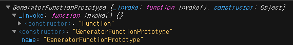
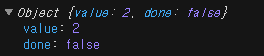

### 함수형 컴포넌트와 클래스형 컴포넌트의 상태 관리

함수형 컴포넌트
```js
const SessionItem = ({ title }) => <li>{title}</li>;

const App = (props) => {
  const [displayOrder, toggleDisplayOrder] = React.useState("ASC");
  const { sessionList } = props.store;
  const orderedSessionList = sessionList.map((session, i) => ({
    ...session,
    order: i
  }));

  const onToggleDisplayOrder = () => {
    toggleDisplayOrder(displayOrder === "ASC" ? "DESC" : "ASC");
  };
  return (
    <div>
      <header>
        <h1>React and TypeScript</h1>
      </header>
      <p>전체 세션 갯수: 4개 {displayOrder}</p>
      <button onClick={onToggleDisplayOrder}>재정렬</button>
      <ul>
        {orderedSessionList.map((session) => (
          <SessionItem title={session.title} />
        ))}
      </ul>
    </div>
  );
};

export default App;
```

setState를 이용해야 상태가 바뀜을 리액트가 감지한다.
이를통해 re rendering이 일어난다.

클래스 컴포넌트는 상태를 가질 수 있다.
constructor에서 생성하고 그 상태는 유지된다. (업데이트 가능) 

ui를 바꾸기 위해 함수형 컴포넌트에서 상태값을 사용하려면 hook을 이용해야한다.
상태값이 바뀌면 리액트가 함수 컴포넌트를 다시 호출하고, 다시 렌더링 되는 것을 볼 수 있다.

#### this
클래스형 컴포넌트

```js

class ClassApp extends React.Component {
  constructor(props) {
    super(props); // React에 있는 method 프로토타입 체인을 통해 접근하고 사용
    // 상태를 만듬

    this.state = {
      displayOrder: "ASC"
    };
  }
  onToggleDisplayOrder() {
    this.setState({
      displayOrder: displayOrder === "ASC" ? "DESC" : "ASC"
    });
  }
  toggleDisplayOrder = () => {
    this.setState({
      displayOrder: displayOrder === "ASC" ? "DESC" : "ASC"
    });
  };

  render() {
    return (
      <div>
        결과
        <button onClick={this.toggleDisplayOrder}>정렬</button>
      </div>
    );
  }
}
```
실행 context(런타임의 this), lexical context(컴파일 타임의 this)
arrow function을 통해 bind를 사용하지 않고도 컴파일 타임의 this로 고정하여 사용할 수 있다.

위의 onToggleDisplayOrder함수는 실행 context를 다르고, toggleDisplayOrder는 arrow function으로 lexical context를 따르게 된다.

실행 context를 사용하면 
```js
<button onClick={this.onToggleDisplayOrder.bind(this)}>정렬</button>
```
또는
```js
constructor(props) {
    super(props); // React에 있는 method 프로토타입 체인을 통해 접근하고 사용
    // 상태를 만듬
    this.onToggleDisplayOrder = this.onToggleDisplayOrder.bind(this)
    this.state = {
      displayOrder: "ASC"
    };
  }
```
constructor에서 bind함수를 이용하여 this를 ClassApp으로 고정하여 반환 해주는 방법을 사용할 수 있다.

arrow function을 이용하면 this는 ClassApp을 가리키고 lexical context를 따르기 때문에 bind를 사용할 필요가 없어 편리하다.


#### 커뮤니케이션 및 학습 tip

상대방이 이해할 수 있는 layer를 파악하기
이해할 수 있는 용어, 표현 사용하기

학습에 있어서도 내가 어떤 지식을 이해할 수 있는 layer가 아니라면 조정하기

#### 비동기, Generator

*가 붙은 함수 => Generator 함수
async가 붙은 함수  => 비동기 함수

```js
function* make() {
  return 1;
}

const i = make();

console.log(i);
```


함수를 여러번 return 할 수 없을까?
=> generator의 yield 사용하기

```js
function* makeNumber() {
  let num = 1;

  while (true) {
    yield num++;      //  yield되는 순간 함수내부 상태를 유지한채로 정지되고 밖으로 나옴
  }
}

const i = makeNumber();

i.next(); //yield나 return이 나올때 까지 실행
//yield된 값 next()로 반환됨
console.log(i.next());
```

value는 yield된 값
done이라는 flag를 통해 generator함수가 끝낫는지 여부를 확인 가능

```js
const delay = (ms) => new Promise((resolve) => setTimeout(resolve, ms));
const delay2 = (ms) => ms;

function* main() {
  console.log("시작");
  yield delay(3000);
  console.log("3초 뒤");
}

const it = main(); //아직 호출안됨
const { value } = it.next();

if (value instanceof Promise) {
  value.then(() => {
    it.next();
  });
} else {
  setTimeout(() => {
    it.next();
  }, value);
}
```

```js
async function main2() {
  console.log("시작");
  await delay(3000);
  console.log("3초 뒤");
}

main2();

```
위 두 코드는 모두 시작과 끝의 메시지가 3초 후에 나타나는 코드이다.
generator는 프로미스 객체이든 value이든 yield를 사용할 수 있지만 await는 프로미스 객체에 대해서만 사용가능하다.
async await는 generator로 만들어졌다.

