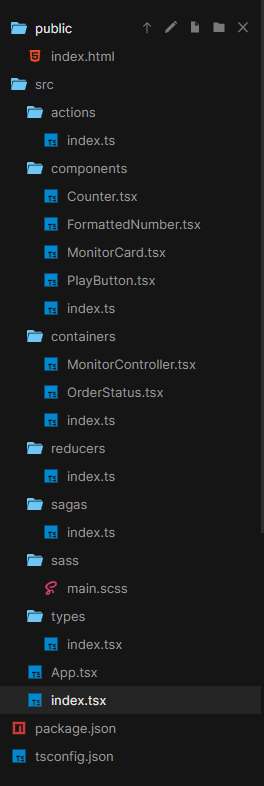
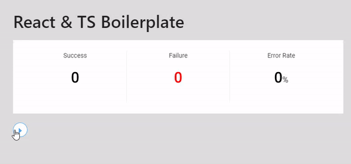
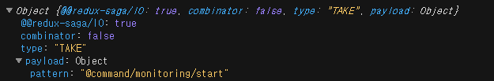
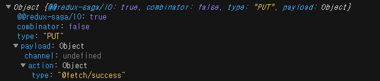

### Redux Saga & TS Boilerplate

Saga는 Redux의 미들웨어이다.

https://codesandbox.io/s/ordermonitor04-n51jrkq2wl?file=/src/index.tsx
위의 주소에 있는 소스를 분석해보자



#### [컨테이너와 컴포넌트 구분](https://www.zerocho.com/category/React/post/57e1428c11a9b10015e803aa)

컨테이너와 컴포넌트 구분을 통해 불필요한 리 렌더링을 막고 유지보수를 용이하게 할 수 있다.

Redux를 사용할 때에는 컨테이너에서 앱의 상태를 관리하고 필요한 컴포넌트로 props를 보내줄 수 있도록 설계해보자

위의 소스는 React, Redux, Saga를이용해 성공횟수, 실패횟수, 에러발생률(가짜 데이터)을 화면에 나타내준다.


./index.tsx 파일부터 살펴보자
JSX문법을 사용하기 위해서는 ts가 아닌 tsx확장자 명을 사용해야한다.
```ts
import * as React from "react";
import { render } from "react-dom";
import { Provider } from "react-redux";
import { createStore, applyMiddleware } from "redux";
import { StoreState } from "./types";
import reducer from "./reducers";
import createSagaMiddleware from "redux-saga";
import rootSaga from "./sagas";
import App from "./App";

const sagaMiddleware = createSagaMiddleware();
const store: StoreState = createStore(reducer, applyMiddleware(sagaMiddleware));
const rootElement: HTMLElement = document.getElementById("root");

sagaMiddleware.run(rootSaga);

render(
  <Provider store={store}>
    <App />
  </Provider>,
  rootElement
);
```
https://redux-saga.js.org/docs/api/
createSagaMiddleware()는 Saga 미들웨어를 생성한다.

createStore를 통해 Redux에 미들웨어로 전달하면 Saga 미들웨어는 Redux 스토어에 연결된다.

sagaMiddleware의 run함수에 제네레이터 함수인 rootSaga를 전달하여 실행해준다.

Provider는 subscribe의 역할, store가 변하면 하위 컴포넌트에 데이터를 보내준다.

하위 컴포넌트들은 명시적으로 어떤 데이터를 받을지를 connect를 통해 설정 가능하다.(모든 컴포넌트의 상태가 다 바뀌지 않도록)

RootSaga인 generator 함수를 살펴보자
./sagas/index.ts
```ts
import { fork, all, take, race, delay, put } from "redux-saga/effects";
import { getType } from "typesafe-actions";
import * as Actions from "../actions";

function* monitoringWorkflow() {
  while (true) {
    yield take(getType(Actions.startMonitoring));

    let loop = true;

    while (loop) {
      yield all([
        put({ type: getType(Actions.fetchSuccess) }),
        put({ type: getType(Actions.fetchFailure) })
      ]);

      const { stoped } = yield race({
        waitting: delay(200),
        stoped: take(getType(Actions.stopMonitoring))
      });

      if (stoped) {
        loop = false;
      }
    }
  }
}

export default function* () {
  yield fork(monitoringWorkflow);
}
```
redux-saga에는 effect creator들이 있다.
여기서 사용하는 fork, all ,take, race ,delay, put에 대해 알아보자

#### [effect creators](https://redux-saga.js.org/docs/api/#effect-creators)

- fork: generator function 또는 Promise를 반환하는 함수를 인자로 받고 non-blocking 으로 호출한다. 
따라서 해당 함수의 종료를 기다리는동안 미들웨어는 멈추지 않는다. (non-blocking)
- all: 여러 effects들을 병렬적으로 실행하고 모두 완료 될 때까지 기다린다.
 Promise.all과 유사하다. (effects에 따라 blocking or non-blocking)
- take: generator는 take(pattern) 의 pattern이 dispatch 될 때 까지 기다린다. 
전달 되는 액션 객체를 반환한다. (blocking)
 
take(getType(Actions.startMonitoring) 반환 값
- race: all과 유사하게 병렬적으로 effects들을 실행하지만, 먼저 resolve되는 값만 반환한다. Promise.race와 유사하다.
 (blocking 이라고 문서에 써져 있지만 non-blocking인 effects들만 주어지는 경우에는 non-blocking 이라고 생각된다.) 
- delay: 전달한 시간 만큼 기다렸다가. True 또는 설정한 값을 반환한다. (blocking)
- put: 액션을 dispatch한다. (non-blocking)
 
put({ type: getType(Actions.fetchSuccess) }) 반환 값

effect creator에 대해 학습한 내용을 바탕으로 전체 내용을 다시 살펴보자.
monitoringWorkflow 제네레이터 함수는 startMonitoring이라는 action이 감지되면, fetchSuccess와 fetchFailure이라는 action을 200ms 단위로 발생시킨다.
stopMonitoring이라는 액션이 발생하였을 경우에 stoped 값이 undefined가 아닌 @command/monitoring/stop 값이 될것이고 그 때 내부 while문에서 탈출할 수 있게된다. 
      
이 전체적인 cycle은 while문에 의해 계속해서 유지된다.               
또한 fork를 통해 monitoringWorkflow를 실행하는 함수를 export하기 때문에 monitoringWorkflow함수는 미들웨어를 멈추게 하지 않는다.


#### [typesafe-actions](https://github.com/piotrwitek/typesafe-actions#createaction)
미리 dispatch action들을 정의 해놓고 typesafe-actions의 createAction과 getType을 이용하여 리덕스의 액션들을 쉽게 관리할 수 있다.

```ts
export const fetchSuccess = createAction("@fetch/success", (resolve) => {
  return () => resolve();
});
  
console.log(getType(Actions.fetchSuccess)); // "@fetch/success"
console.log(Actions.fetchSuccess());
// {type: "@fetch/success", payload: undefined, meta: undefined, error: undefined}
```


