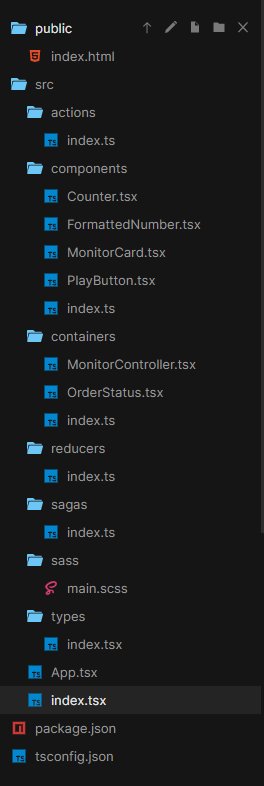

https://codesandbox.io/s/ordermonitor04-forked-4qmnb?file=/src/containers/MonitorController.tsx


저번시간에 이어서 container 컴포넌트를 살펴보자

MonitorController.tsx
```ts
import React from "react";
import { Dispatch } from "redux";
import { connect } from "react-redux";
import { StoreState } from "../types";
import { startMonitoring, stopMonitoring } from "../actions";
import { PlayButton } from "../components";

export interface MonitorControllerProps {
  monitoring: boolean;
  onStart(): void;
  onStop(): void;
}

const mapStateToProps = (state: StoreState) => {
  return {
    monitoring: state.monitoring
  };
};

const mapDispatchToProps = (dispatch: Dispatch) => ({
  onStart: () => {
    dispatch(startMonitoring());
  },
  onStop: () => {
    dispatch(stopMonitoring());
  }
});

class MonitorController extends React.PureComponent<MonitorControllerProps> {
  render() {
    return (
      <div>
        <PlayButton
          monitoring={this.props.monitoring}
          onPlay={this.props.onStart}
          onPause={this.props.onStop}
        />
      </div>
    );
  }
}

export const MonitorControllerContainer = connect(
  mapStateToProps,
  mapDispatchToProps
)(MonitorController);

```
MonitorController는 React.PureComponent를 상속받는다.
PureComponent라는 건 `동일한 입력에 대해 동일한 결과를 반환`하는 컴포넌트이다.
잘 알고 있는 순수함수와 같다.

컴포넌트는 Generic 인자로 P(props), S(state), SS(snapshot)을 받는다.

SS는 잘몰랐지만 찾아보니 업데이트 이전의 render 정보(ex 스크롤위치)를 얻는 데 사용된다고 한다.
[what is SS](https://stackoverflow.com/questions/57059348/what-does-ss-stand-for-in-a-react-component-declaration)

[react-redux](https://react-redux.js.org/using-react-redux/connect-mapstate)

#### mapStateToProps
저장소의 state를 인자로 받고, 반환하는 object를 props로 컴포넌트에 전달한다..
스토어가 변경될 때 마다 실행된다.

반환 되는 object의 contents가 바뀔 때만 컴포넌트가 re-render된다.
이 부분을 잘 살펴보면 "shallow equality" check라고 쓰여있다.
즉 object의 reference만 비교할 뿐이지, 실제 내부의 value를 비교하지 않는다.

#### mapDispatchToProps
redux의 dispatch를 인자로 받고, 특정 액션에 대한 dispatch를 실행하는 함수를 반환하고 컴포넌트의 props로 전달한다.

#### connect: (react-redux)

Provider => subscribe의 역할, store가 변하면 하위 컴포넌트에 데이터를 보내줌
명시적으로 어떤 컴포넌트가 어떤 데이터를 받을지를 connect를 사용 가능(모든 컴포넌트의 상태가 다 바뀌지 않도록)

connect 는 high order 함수
mapStateToProps,mapDispatchToProps 라는 함수를 통해 필요로 하는 state, dispatch를 뽑아서 반환하고 connect 함수를 통해 컴포넌트에 주입 

그 다음 그 반환 값을 export하면 state와 dispatch를 실행하는 함수가 props로 주입된 component를 사용할 수 있다.

단점: 코드의 반복이 불가피, 보일러 플레이트가 많다
대안 => react-redux에서도 useSelector, useDispatch훅을 지원한다.

MonitorController컨테이너의 자식 컴포넌트인 PlayButton을 보자

PlayButton.tsx
```js
import React from "react";
import { Button } from "antd";

interface PlayButtonProps {
  monitoring: boolean;
  onPlay?: () => void;
  onPause?: () => void;
}

export const PlayButton: React.FC<PlayButtonProps> = ({
  monitoring,
  onPause,
  onPlay
}) => {
  const renderIcon = monitoring ? "pause" : "caret-right";
  return (
    <Button
      style={{ marginTop: 20 }}
      shape="circle"
      icon={renderIcon}
      onClick={() => {
        if (monitoring) {
          onPause && onPause();
        } else {
          onPlay && onPlay();
        }
      }}
    />
  );
};


```
PlayButton컴포넌트는 props로 전달받은 monitoring, onpause, onPlay를 사용하고 있다.
isPlay라는 상태값과 토글을 이용하여 버튼의 아이콘과 눌렀을 때의 콜백함수를 바꾸어 주고있다.

버튼을 누르게 되면, monitoring 값에 따라 onPause() 또는 onPlay()함수가 호출된다.
이 함수는 dispatch를 호출하고, 액션은 리듀서로 전달된다.

reducer
```js
    case getType(Actions.startMonitoring):
      return {
        ...state,
        monitoring: !state.monitoring
      };
    case getType(Actions.stopMonitoring):
      return {
        ...state,
        monitoring: !state.monitoring
      };
```
monitoring action이 들어오면 monitoring값을 토글시킨다.

Saga
```js
function* monitoringWorkflow() {
  while (true) {
    yield take(getType(Actions.startMonitoring));

    let loop = true;

    while (loop) {
      yield all([
        put({ type: getType(Actions.fetchSuccess) }),
        put({ type: getType(Actions.fetchFailure) })
      ]);

      const { stoped } = yield race({
        waitting: delay(200),
        stoped: take(getType(Actions.stopMonitoring))
      });

      if (stoped) {
        loop = false;
      }
    }
  }
}
```
또한 Redux-Saga에서는 
yield take(getType(Actions.startMonitoring))를 통해
startMonitoring액션을 대기하고 액션의 흐름을 유지해준다.  

위의 monitoringWorkflow에서는 startMonitoring과 race에서만 blocking이 발생한다.
Redux-Saga는 flow를 통해 반복적인 작업(버튼클릭) 관리, Side effects 처리에 있어 유리하다.

#### [TypeScript] interface, type 차이

interface는 새로운 필드를 추가할 수 있지만, type은 변경 불가능 하다.
```ts
interface ex1{
    name: string,
    age: number
}

interface ex1{
    budget: number
}

const man: ex1 = {
    name: 'jeff',
    age: 55,
    budget: 10000
}
```

```ts
type ex1 = {
    name: string,
    age: number
}

type ex1 = {
    budget: number
}

// Duplicate identifier 'ex1'.
```

type은 interface와 달리 computed property를 사용할 수 있다.
```ts
type Keys = "firstname" | "subname"

type name = {
  [key in Keys]: string
}

const man: name = {
  firstname: "Seo",
  subname: "jihwan"
}
```


#### generic

```ts
function identity<T>(arg: T): T {
  return arg;
}

interface GenericIdentityFn {
  <T>(arg: T): T;
}

function identity<T>(arg: T): T {
  return arg;
}

let myIdentity: GenericIdentityFn = identity;
```
generic을 이용하면 임의의 문자를 <>사이에 넣어 해당 문자를 임의의 같은 타입으로 동적 설정이 가능하다

```ts
function loggingIdentity<T>(arg: T): T {
  console.log(arg.length); // Property 'length' does not exist on type 'T'.
  return arg;
}
```
length 라는 method는 Array에만 존재하기 때문에 보장 해줄수 없기 때문에 위와 같은 메시지가 나오게 된다.