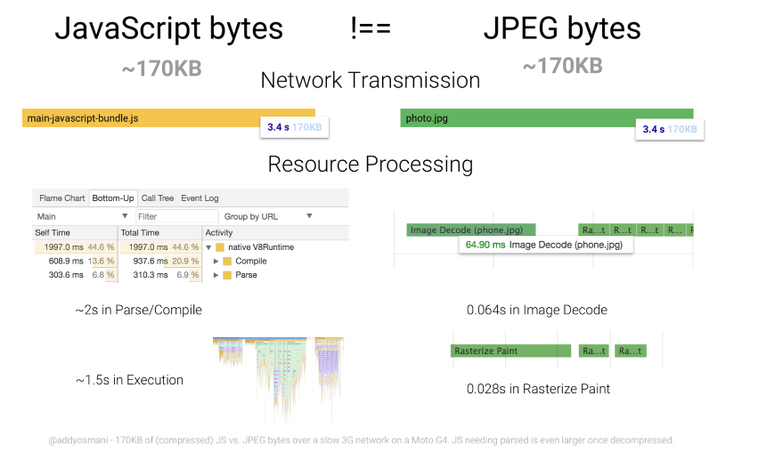
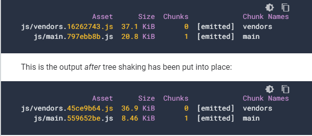

### Reduce JavaScript payloads with Tree shaking

리소스 처리와 압축은 관련이 없다.
300KB의 압축된 자바스크립트는 압축을 풀고 900KB이 되고, 결국 900KB의 압축이 풀린 자바스크립트에 대해 파싱, 컴파일, 실행의 과정이 필요하다.

자바스크리트는 비싼 리소스이다.
이미지는 다운받게되면 상대적으로 짧은 디코딩 시간이 필요하지만, 자바스크립트는 파싱, 컴파일, 실행의 과정을 거치기 때문에 훨씬 값비싼 리소스라고 말할 수 있다.



지속적으로 자바스크립트 엔진의 효율성을 발전시키고 있기는 하지만 결국 자바스크립트의 퍼포먼스를 끌어올리기 위해서는 코드 스플리팅이 사용된다.

하지만 자바스크립트 사용량이 많은 프로그램의 문제(한 번도 사용되지 않는 코드가 포함된)를 해결하지는 않는다. 이 문제는 tree shaking으로 해결할 수 있다.

### What is tree shaking?

tree shaking이란 죽은 코드 제거를 제거하는 것
Rollup에 의해 대중화 되었지만, webpack에서도 이미 존재하는 개념이다.

```js
// Import all the array utilities!
import arrayUtils from "array-utils";
```

```js
// Import only some of the utilities!
import { unique, implode, explode } from "array-utils";
```
위의 두 코드는 array-utils의 모든 모듈을 import하는지와 일부만 import하는지에 대한 차이가 있다.

개발모드에서는 큰 차이가 없지만 프로덕션 모드에서는 웹팩을 통해 명시적이지 않은 import를 방지할 수 있다.

### Finding opportunities to shake a tree

babel-preset-env를 사용한다면, es6 모듈을 건들지 않도록 해야한다.
webpack에서 tree shaking은 CommonJS모듈에 적용하기 더 어렵다고 한다.

### keeping side effects in mind

사이드 이펙트가 없어야 예측가능한 입력에 대하여 예측가능한 결과를 반환할 것이기 대문에 tree shaking 가능하다.

webpack config의 module.rules나 package.json 의 sideEffects에 명시적으로 (특정 파일 또는 전체에)sideEffects가 있음을 알려줄 수 있다.

### Importing only what we need

array-utils의 simpleSort 만 import할 때와 utils 전체를 가져오고 utils.simpleSort를 호출할 때의 차이를 보자



사용되지 않는 utils들을 tree shaking 함으로써 스크립트의 다운시간과, 처리시간을 줄일 수 있음을 확인할 수 있다.

### When things aren't so straightforward

tree shaking의 효과가 없는 경우 CommonJS패턴인지 확인해봐라
CommonJS 패턴을 다루기 위한 플러그인들이 존재하지만 일부의 CommonJS 패턴에만 가능할 것이다. 안정적으로 tree shaking을 하려면 ES6 모듈을 사용해라


출처:
https://developers.google.com/web/fundamentals/performance/optimizing-javascript/tree-shaking

https://webpack.js.org/guides/tree-shaking/