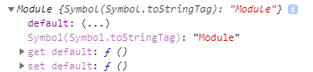
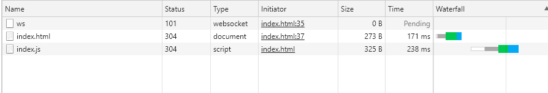
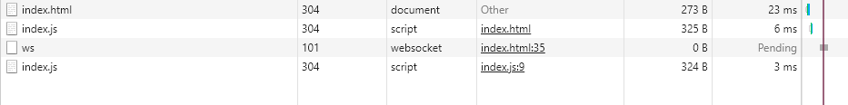

### Reduce JavaScript payloads with code splitting

어플리케이션을 로드했을때 필요한 초기 route에 관련한 코드만 보내기 위해 자바스크립트 번들을 분리해라

```js
import moduleA from "library";

form.addEventListener("submit", e => {
  e.preventDefault();
  someFunction();
});

const someFunction = () => {
  // uses moduleA
}
```


위의 예시에서 moduleA는 someFunction에서만 사용된다고 가정하자.

```js
form.addEventListener("submit", e => {
  e.preventDefault();
  import('library.moduleA')
    .then(module => module.default) // using the default export
    .then(someFunction())
    .catch(handleError());
});

const someFunction = () => {
    // uses moduleA
}
```
그렇다면 위와 같이 dyanamic import를 적용하고 폼이 전송될 때 moduleA를 fetch 해오게 된다. 콘솔로 찍어보면 promise 객체가 전달되고, Module객체를 resolve하는 것을 확인할 수 있다.



lazyload로 불러오기 이전 network탭


lazyload로 불러온 후 network탭

초기에 불러오지 않는 것을 확인할 수 있다. (lazy load)

하지만 lazy loading된 리소스가 너무 큰 경우엔 사용감이 떨어질 수도 있고, 사용자의 네트워크 환경이 원활해야한다 등등 여러 제약 조건도 발생한다. 상황에 맞게 잘 활용하면 좋은 웹앱 성능을 만들 수 있을것 같다.

출처:
https://web.dev/reduce-javascript-payloads-with-code-splitting/