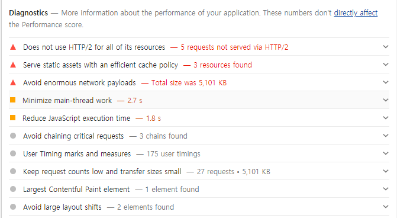

### 웹 성능 최적화 - (1)

---

왜 성능 최적화를 할줄 알아야 하는가?

1. 이용자가 떠나지 않도록 하기 위해 (웹 사용성)
2. 프론트 엔드 개발자로서 경쟁력


---
### 웹 성능 결정 요소

- 로딩성능
- 렌더링성능


[로딩 / 렌더링](https://ui.toast.com/fe-guide/ko_PERFORMANCE/)


브라우저가 화면을 어떻게 그리는지 이해해야한다.

---
#### 로딩 성능 최적화

- 이미지 사이즈 최적화
- Code Split
- 텍스트 압축

---
#### 렌더링 성능 최적화
- bottleneck 코드 최적화(병목 현상을 일으키는 코드 제거)

---
#### 분석 툴

- chrome 개발자도구
  - 네트워크 탭, performance 탭, auidt(Light house)탭

- webpack-bundle-analyzer

---
#### 성능 분석
Lighthouse

audit툴 에서 Lighthouse로 바뀜


웹 페이지의 문제점과 가이드 제시

Trace


웹 페이지가 그려지는 모습을 시각화

#### Opportunities
리소스 즉 로딩성능 최적화와 관련
 

#### Diagonostics
페이지의 실행 관점 즉 렌더링 성능과 관련
 

#### Passed auidts
잘 적용된 항목들


#### Runtime Settings
검사 환경


레티나 디스플레이는 화면에 더 많은 픽셀을 표현할 수 있기 때문에
화면에 나타나는 2배정도의 이미지 사이즈를 사용하는게 적절

이미지가 서버에 저장되어있는 static resource라면 직접 파일을 자를 수 있겟지만
api를 통해 받아오는 경우는 어떻게 줄일 수 있을까?


#### CDN: Contents Delivery Network

물리적 거리의 한계를 극복하기 위해 사용자와 가까운 곳에 컨텐츠 서버를 두는 기술

ex) 한국의 사용자가 미국의 서버에 있는 img파일을 다운받는데 시간이 많이 소요됨
=> 미리 미국에 있는 서버에서 한국에 있는 서버로 img파일을 다운받고 사용자에게 전달하자

#### Image CDN

image processing CDN

ex) 1200 x 1200 의 이미지를 240 x 240으로 가공해서 사용자에게 보내줌
이미지를 제공하는 API에서 옵션을 제공받거나 image CDN을 사용하는 방법이 있다.

Minify JavaScript

Reduce JavaScript execution time 

자동화 도구의 한계점: 어떤 코드 때문에 오래걸렷는지 알 수 없기 때문에 performance 탭을 사용

#### Performance

페이지가 로드 되면서 실행되는 작업들을 타임라인과 차트 형태로 보여줌


Main에서 어떤 코드의 실행이 오래걸리는지 파악 가능하다.

---
#### Bottleneck(병목 현상) 해결방안

병목 현상이 발생하는 코드를 찾았다면, 해당 알고리즘을 개선하거나 작업량을 줄이는 방법을 고려할 수 있다.

---
#### bundle size 최적화

자바스크립트(리소스) 다운 받는데 걸리는 시간이 길다
=> 다운 받고 이후에 코드가 실행되기 때문에 화면이 나타나는데 시간이 오래걸리게 됨

=> webpack bundle analyzer 사용해보기
##### cra에서의 해결방법

npm install --save-dev cra-bundle-analyzer
npx cra-bundle-analyzer


빌드 폴더에 분석 결과가 html파일로 생성된다.

refractor라는 패키지가 많은 용량을 차지하고 있으므로 이를 해결해보자.

package-lock.json에 
해당 모듈을 사용하기 위한 하위 모듈들이 명시됨


refractor를 사용하는 react-syntax-highlighter는 블로그의 글에 대하여 코드의 block을 생성하는 라이브러리이다.
view 페이지에서만 사용하기 때문에 code splitting을 통해 불필요한 리소스를 줄이고 초기 페이지의 로딩 성능을 개선가능하다.


##### code splitting
코드 분할

bundel파일 하나로 모든 코드(모듈 포함)를 다운받기 때문에 로딩시간이 길어짐
`불필요한 코드` 또는 `중복 코드` 없이 `적절한 사이즈`의 코드가 `적절한 타이밍`에 로드 될 수 있도록 하기

https://reactjs.org/docs/code-splitting.html

lazy를 통해 런타임에 동적으로 컴포넌트를 로드
동적으로 로딩하기 때문에 컴포넌트가 로딩되는데 시간이 필요함

Suspense를 통해 아직 컴포넌트가 로드 되지 않았을 경우에 로딩 화면을 만들어 줄 수 있다.
```js
import React, { Suspense, lazy } from 'react';
import { Switch, Route } from 'react-router-dom';
import './App.css';
const ListPage = lazy(() => import('./pages/ListPage/index'));
const ViewPage = lazy(() => import('./pages/ViewPage/index'));

function App() {
  return (
    <div className="App">
      <Switch>
        <Suspense fallback={<div>Loading...</div>}>
          <Route path="/" component={ListPage} exact />
          <Route path="/view/:id" component={ViewPage} exact />
        </Suspense>
      </Switch>
    </div>
  );
}
```


번들파일이 둘로 나뉜 것을 확인할 수 있다.

webpack의 코드 스플리팅 설정
https://webpack.js.org/guides/code-splitting/


#### 텍스트 압축하기

GZIP, Deflate: 대표적인 텍스트 압축 알고리즘

develop 환경과 build (실 서비스) 환경은 다름
=> 파일의 크기가 2kb 이상인 파일들에 대하여 텍스트 압축을 적용하기

