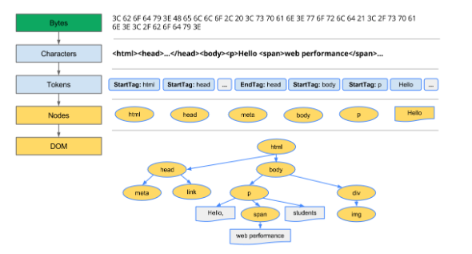

## Rendering Path

브라우저가 HTML, CSS, 자바스크립트를 사용하여 화면에 렌더링된 픽셀로 보여주는 과정

### 객체 모델 생성

DOM, CSSOM 트리 생성

HTML 마크업은 DOM(Document Object Model)으로 변환

CSS 마크업은 CSSOM(CSS Object Model)으로 변환

DOM 및 CSSOM은 서로 독립적인 데이터 구조

크롬 개발자 도구를 이용하여 DOM과 CSSOM의 생성 및 처리 비용 확인 가능

### DOM
바이트 → 문자열 → 토큰 → 노드 → DOM

1. HTML의 원시 바이트를 디스크나 네트워크에서 읽고 인코딩 하여 개별 문자로 변환

2. 문자열을 웹 표준 토큰으로 변환

3. 토큰은 속성 및 규칙을 정의하는 객체로 변환

4. 생성된 객체들을 트리 데이터 구조로 구성

DOM트리는 문서 마크업의 속성 및 관계

### CSSOM 
브라우저가 DOM을 생성하는 동안(head 섹션에서 link 태그를 접한 시점!) CSS에 대한 리소스를 요청하고 마찬가지의 과정을 거친다.
바이트 → 문자열 → 토큰 → 노드 → DOM

하향식 규칙을 적용

### Rendering tree

CSSOM 과 DOM 트리는 결합하여 렌더링 트리를 형성

렌더링 트리는 화면에 표현되는 각 요소의 레이아웃의 계산에 사용되고
픽셀을 화면에 렌더링하는 페인트 프로세스에 대한 입력으로 처리

렌더링 트리 생성 과정 (브라우저 작업 수행)
1. DOM트리의 루트 노드부터 순회
(렌더링 출력에 상관없는, 스크립트 태그, 메타 태그 생략, 일부 노드는 CSS를 통해 숨겨진다. 렌더링 트리에서도 생략 ex)display:none)
2. 각 노드에 CSSOM 규칙을 적용
3. 컨텐츠 및 계산된 스타일과 함께 노드들을 내보냄

### layout(reflow)

기기의 뷰포트 내에서 노드의 정확한 위치와 크기 계산

### painting(rasterizing)
각 노드를 화면의 실제 픽셀로 변환

### 브라우저 렌더링 과정 요약
1. HTML 마크업 → DOM 트리
2. CSS 마크업 → CSSOM 트리
3. DOM + CSSOM → 렌더링 트리
4. 레이아웃 과정(각 렌더링 트리 노드의 위치 크기 계산)
5. 개별 노드 화면에 페인트

DOM 또는 CSSOM이 수정된경우 이 프로세스를 다시 반복해야함.

렌더링 최적화 작업은 1~5단계를 수행할 때 걸린 총 시간을 최소화하는 프로세스

출처:https://developers.google.com/web/fundamentals/performance/critical-rendering-path