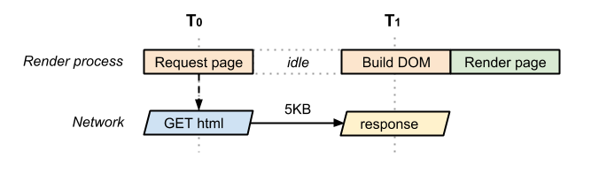

## Rendering Path - 2

### Rendring-Blocking CSS

HTML,CSS는 렌더링 차단(blocking) 리소스다

즉, DOM, CSSOM이 생성될 때까지 브라우저는 컨텐츠를 렌더링하지 않는다.

미디어 쿼리를 통해 조건이 성립할 때에만 스타일시트가 다운되도록 설정할 수 있다.

우선순위가 낮더라도 조건을 성립하면 브라우저는 스타일시트를 다운받는다.

### Adding interactivity with JavaScript

HTML 파서는 스크립트 태그를 만나면 DOM 생성 프로세스를 중지하고 자바스크립트 엔진에 제어 권한을 넘김

스크립트를 실행하려는 경우 브라우저가 CSSOM을 다운로드하고 빌드하는 작업을 완료하지 않았다면 브라우저가 CSSOM을 생성할때 까지 스크립트 실행 및 DOM 생성 지연시킨다.

```html
<script src="app.js" async></script>
```
async를 통해 스크립트가 참조되는 시점에 스크립트를 실행할 필요가 없음을 브라우저에게 알려줄 수 있다.

### Measuring the Critical Renderging Path

좋은 성능은 좋은 측정과 계측이 바탕이 된다.

- Ligth house를 통한 성능 측정: CRP
- Navigation Timing API 접근방식

CRP 최적화의 기회를 파악하고 Navigation Timing API로 코드 작성 후 앱의 실제 성능 모니터링 하는 방법이 좋은 방식이라고 한다.

Ligthhouse로 웹 앱 페이지 분석하기https://developers.google.com/web/tools/lighthouse

위에 대한 내용은 다음 글에서 다루기로 한다.

Navigation Timing API와 여러 브라우저 이벤트를 조합해서 임의 페이지의 `실제` CRP를 캡처할 수 있다.


- domLoading: 브라우저가 HTML 문서 바이트 파싱 시작
- dominteractive: 브라우저가 파싱을 완료하고 DOM 생성 완료
- domContentLoaded: blocking stylesheets이 없는상태 => 렌더링 트리 생성 가능(?)
- domComplete: 모든처리(렌더링 트리, 레이아웃, 페인트) 완료, 모든 리소스 다운로드 완료
- loadEvent: 페이지 최종단계, onload 이벤트 발생

### Analyzing Critical Rendering Path Performance

async를 사용하면 브라우저의 파서가 자바스크립트를 차단 하지않고 CSSOM생성과 같이 파싱된다.

domContentLoaded 이벤트가 HTML이 파싱된 후 바로 실행된다.

=> 이부분이 이해가 조금 안되는 점은 위의 설명에서는 렌더링 트리 생성이 가능해야 한다고 쓰여져 있지만 아직 CSSOM이 파싱되지 않은 시점이기 때문이다.

어쨋든 렌더링 경로를 최적화할 때 서로 다른 리소스의 의존성, 중요도에 따라 최적의 전략을 찾아야 한다.

### 성능 패턴


HTML마크업으로만 이루어진 경우

HTML파일이 작을 경우 한 번의 네트워크 왕복으로 전체 문서 가져올 수 있음


HTML을 파싱하는 중에 CSS파일이 필요함을 알고 요청을 보냄
네트워크 최소 2번의 왕복 필요


브라우저가 HTML을 파싱하는 중 두 리소스를 찾고(CSS와 JS) 동시에 요청함

자바스크립트는 파서 차단 리소스(주요 리소스)
자바스크립트가 CSSOM을 처리하는 것을 방지하기 위해 브라우저가 일시 중지 됨 (CSSOM빌드, 자바스크립트 실행 이후에 DOM의 빌드가 이루어짐)


페이지에 포함된 자바스크립트를 차단하지 않기 위해 async 속성 사용

스크립트는 더이상 DOM 파싱하는 것을 막지 않고 CSSOM이 빌드되는 것을 기다림
따라서 domContentLoaded 이벤트는 Build DOM 바로 뒤로 앞당겨짐


미디어 쿼리 조건에 의해 CSS 스타일시트가 필요하지 않은 경우
DOM 생성이 완료되자마자 페이지 렌더링이 가능해짐

하지만 위의 예는 상황에 따라 가능하다의 정도로 받아들여짐

추가로 defer 태그는 DOM의 파싱이 끝난 이후에 자바스크립트를 실행한다.

문서를 읽고 글을 작성해 보았지만 아직 모르는 개념이 많아 이해하지 못한 것 같다.

async 와 defer를 지원하지 않는 브라우저들도 있지만, 일단 무조건적으로 script defer => script async => script를 사용하면 이점이 있지 않을까?? 라는 의문이 들었다.

### sciprt, async, defer의 비교


### 의문점 정리
- domContentLoaded의 정확한 역활
- domContentLoaded에서 CSSOM이 빌드되지 않은 경우(blocking CSS만 없는경우) 렌더 트리를 형성할 수 없지 않을까?
- script, async, defer 에서 defer이 제일 좋은 것 아닌가?

출처:https://developers.google.com/web/fundamentals/performance/critical-rendering-path

https://www.growingwiththeweb.com/2014/02/async-vs-defer-attributes.html