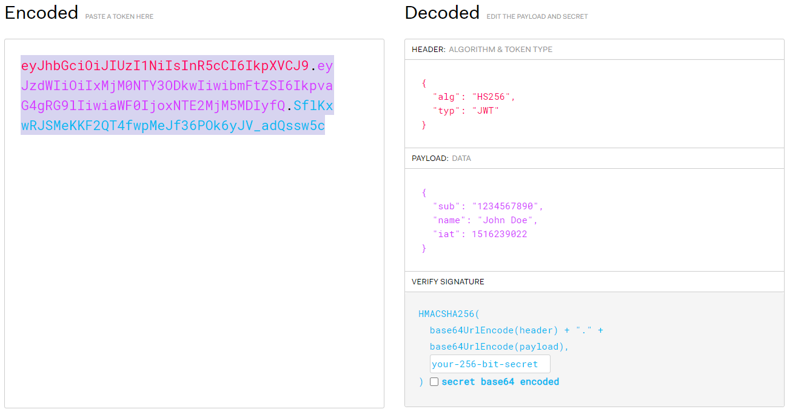
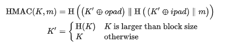
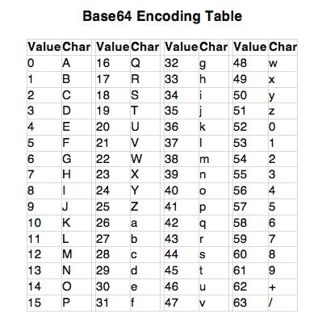
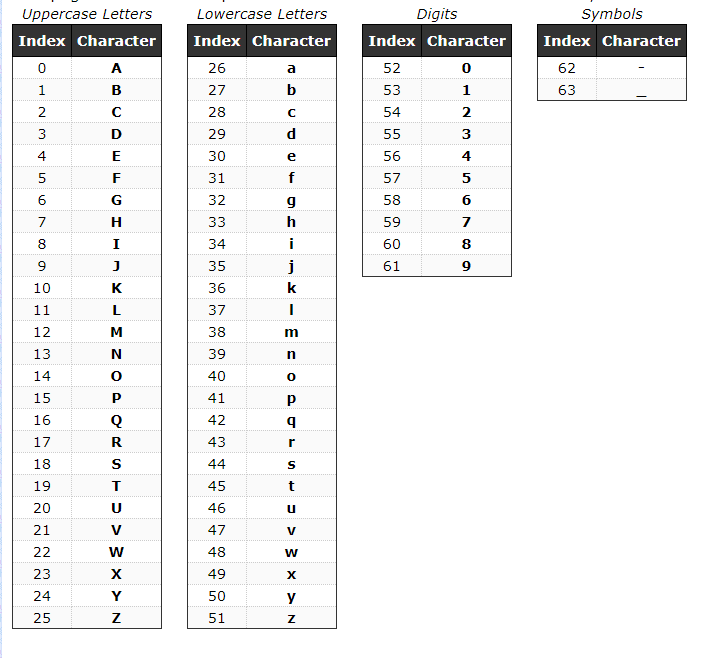

### JWT: JSON Web Token

JWT를 보면 인코딩된 결과 값이 .으로 구분되는 것을 확인할 수 있다.

헤더와 페이로드는 Base64Url 인코딩 되고 서명 값은 비밀키와 함께 HMAC알고리즘을 통해 암호화된다.

출처: https://jwt.io/

HAMC함수

출처: https://en.wikipedia.org/wiki/HMAC

H = 해쉬함수
m = 메시지
K = 비밀 키

인코딩 된 서명 값을 알더라도 비밀 키를 모른다면 JWT를 만들어 낼 수 없다.

서버는 인코딩 된 토큰 값을 비밀키를 이용해 검증할 수 있으므로 JWT를 인증에 사용한다.

Header와 Payload값은 인코딩 되더라도, 쉽게 디코딩 할 수 있으므로, 외부로 노출 될 수 있다.

해쉬함수의 역 추적과정이 어려운 이유
- Bit dependency: 각각의 출력 비트는 모든 비트 각각에 영향을 받는다.
- Avalanching: 하나의 입력 비트를 바꾸는 것은 알고리즘의 내부 상태와 최종 결과 값에 큰 영향을 줌
- Non-linearity: 선형적이지 않은 동작에 의해 출력을 통해 입력 값을 구하기 힘듬

출처: https://crypto.stackexchange.com/questions/45377/why-cant-we-reverse-hashes
https://base64.guru/learn/base64-algorithm/encode
## base64 Encode
8비트 바이트를 6비트 바이트로 변환하는 인코딩으로 모든 데이터를 일반 텍스트로 변환할 수 있다.

### 변환 과정 예시

#### 1.문자열을 문자단위로 구분
"ABC" => A, B, C

#### 2.각 문자를 아스키 테이블에 대응되는 이진 값으로 변환
01000001 (65)
01000010 (66)
01000011 (67)

#### 3. 전부 합친 후에 6비트 단위로 구분
010000010100001001000011

010000
010100
001001
000011

#### 4. prefix인 00을 맨앞에 붙임 
6비트 단위로 구분되지 않는 경우 마지막 그룹에는 subfix로 0을 뒤에 채움

00010000
00010100
00001001
00000011

#### 5. base64 Table에 따라 변환
결과값: QUJD

출처: https://stackabuse.com/encoding-and-decoding-base64-strings-in-python/

#### base64 url 인코딩:
base64의 64의 인코딩에서 +와 /는 url에서 잘못 해석될 수 있기 때문에 -와 _로 대체한다.

출처: https://codebeautify.net/base64

