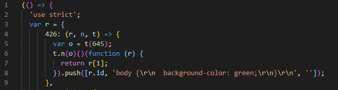
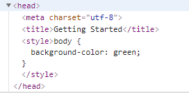

## webpack loader
https://webpack.js.org/loaders/
웹팩의 로더는 js이외의 모든 정적 리소스 파일들을 번들링 해준다.

몇 가지 로더들의 기능을 살펴보자
### css-loader
https://webpack.js.org/loaders/css-loader/

css파일을 모듈처럼 사용가능하게 해주는 로더

webpack.config.js
```js
const path = require('path');
module.exports = {
  entry: './src/index.js',
  output: {
    path: path.resolve(__dirname, 'dist'),
  },
  module: {
    rules: [
      {
        test: /\.css$/i,
        use: ['css-loader'],
      },
    ],
  },
};
```

src/style.css
```css
body {
  background-color: green;
}
```

src/index.js
```js
import './style.css';
```

index.html
```html
<!doctype html>
<html>
  <head>
    <meta charset="utf-8"/>
    <title>Getting Started</title>
  </head>
  <body>
    <script src="./dist/main.js"></script>
  </body>
</html>
```

dist/bundle.js

css-loader를 이용하면 css파일을 모듈처럼 가져올 수 있게 된다.
위의 bundle.js에서 css의 코드들이 js로 바뀌어 들어간 것을 확인할 수 있다.
해당 css를 index.html파일에 적용하려면 style-loader가 추가적으로 필요하다.

### style-loader
https://webpack.js.org/loaders/style-loader/

CSS를 DOM에 주입하는 로더

webpack.config.js
```js
const path = require('path');
module.exports = {
  entry: './src/index.js',
  output: {
    path: path.resolve(__dirname, 'dist'),
  },
  module: {
    rules: [
      {
        test: /\.css$/i,
        // 로더는 오른쪽 부터 순차 처리된다.
        use: ['style-loader', 'css-loader'],    
      },
    ],
  },
};
```

head에 style태그로 css가 적용된 것을 확인할 수 있다.

css-loader를 통해 CSS파일을 모듈로 불러오고 자바스크립트로 변환한 후에
style-loader를 통해 CSS를 DOM에 주입한다.

### file-loader
https://webpack.js.org/loaders/file-loader

파일을 모듈처럼 사용가능하게 해주는 로더

webpack.config.js
```js
const path = require('path');
module.exports = {
  module: {
    rules: [
      {
        test: /\.(png|jpe?g|gif)$/i,
        loader: 'file-loader',
        options: {
          name: '[path][name].[ext]', // 경로, 파일명, 확장자명이 유지된다.
        },
      },
    ],
  },
};
```
### babel-loader
https://webpack.js.org/loaders/babel-loader/

자바스크립트 파일을 트랜스파일링 해주는 로더

webpack.config.js
```js
module: {
  rules: [
    {
      test: /\.m?js$/,
      exclude: /(node_modules|bower_components)/,
      use: {
        loader: 'babel-loader',
        options: {
          presets: ['@babel/preset-env']
        }
      }
    }
  ]
}
```

src/index.js
```js
const defaults = { size: '10px' };
const styles = {
  ...defaults,
  color: '#f5da55',
};
```

babel-loader를 실행하면 아래와 같이 변환된다.

dist/bundle.js
```js
(() => {
  function e(e, r) {
    var t = Object.keys(e);
    if (Object.getOwnPropertySymbols) {
      var n = Object.getOwnPropertySymbols(e);
      r &&
        (n = n.filter(function (r) {
          return Object.getOwnPropertyDescriptor(e, r).enumerable;
        })),
        t.push.apply(t, n);
    }
    return t;
  }
  function r(r) {
    for (var n = 1; n < arguments.length; n++) {
      var o = null != arguments[n] ? arguments[n] : {};
      n % 2
        ? e(Object(o), !0).forEach(function (e) {
            t(r, e, o[e]);
          })
        : Object.getOwnPropertyDescriptors
        ? Object.defineProperties(r, Object.getOwnPropertyDescriptors(o))
        : e(Object(o)).forEach(function (e) {
            Object.defineProperty(r, e, Object.getOwnPropertyDescriptor(o, e));
          });
    }
    return r;
  }
  function t(e, r, t) {
    return (
      r in e
        ? Object.defineProperty(e, r, {
            value: t,
            enumerable: !0,
            configurable: !0,
            writable: !0,
          })
        : (e[r] = t),
      e
    );
  }
  r(r({}, { size: '10px' }), {}, { color: '#f5da55' });
})();
```

targets 옵션을 통해 적용될 브라우저 대상의 범위나 버전을 지정할 수 있다.
해당 범위에 맞는 문법으로 JavaScript를 트랜스파일링 해준다.
Promise, Set같은 경우에는 대체할 수 있는 문법이 없으므로 Polyfill이 필요하다.
이런 경우에는 useBuiltIns 옵션을 사용하거나 @babel/polyfill을 진입파일에 불러오는 방법을 사용한다.

익스플로러에서는 @babel/polyfill, useBuiltIns옵션을 이용하더라도 promise를 사용할 수 없었다. 대안 책으로 promise 라이브러리인 bluebird.js를 사용하는 방법이 있다고한다.

### ts-loader     
https://webpack.js.org/guides/typescript/

타입스크립트를 자바스크립트 문법으로 바꾸어준다.

```js
const path = require('path');
module.exports = {
  entry: './src/index.ts',
  output: {
    path: path.resolve(__dirname, 'dist'),
  },
  module: {
    rules: [
      {
        test: /\.tsx?$/,    
        use: 'ts-loader',
        exclude: /node_modules/,
      },
    ],
  },
};
```

typescript를 설치하고 tsconfig.json을 설정한 다음 ts-loader를 동작시킬 수 있다.
