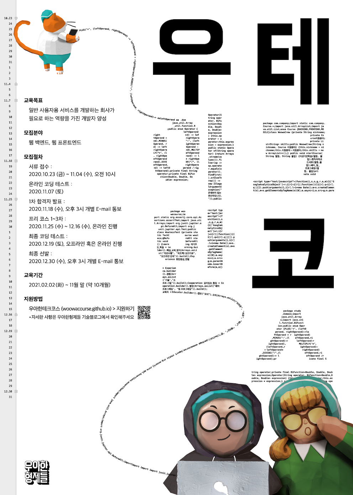

3주간의 미션과정이 끝나고 이제 오프라인 코딩테스트를 앞두고 있습니다. 

프리코스에 대한 후기를 남겨보았습니다!

## 1주차
1주차에는 숫자 야구 게임을 구현하는 과제였습니다.

컨벤션 문서를 보면서 어떤 prettier에 옵션을 적용해보고, 들여쓰기를 최소화 하려고 노력했습니다.

그렇게 구현을 마치고 제출을 빠르게 했지만 다른 분들의 코드와 피드백을 확인하면서 조금 부끄러웠습니다.

제가 만든 코드는 index.js라는 진입 파일에서 모든 구현이 다 들어가 있었습니다.

요구사항에만 몰입해서 정작 좋은 코드는 만들지 못했다고 생각하였습니다.

[1주차 PR](https://github.com/woowacourse/javascript-baseball-precourse/pull/4)

## 2주차
2주차에 자동차 경주 게임을 구현할 때에는 모듈화를 통해 기능에 따라 파일을 나누려고 노력했습니다.

하지만 1주차와 마찬가지로 처음 작성한 구현 코드는 index.js에 모두 구현되었기 때문에 제가 작성한 코드임에도 전체 흐름을 파악하기 힘들었고, 모듈화를 하는 과정에서 구현보다 훨씬 많은 시간이 소요되었습니다.

다시한번 모듈화의 중요성을 깨닫는 순간이었습니다.

[2주차 PR](https://github.com/woowacourse/javascript-racingcar-precourse/pull/27)

## 3주차
3주차에는 미션 요구사항을 보면서 설계하는데에 더 시간을 갖게 되었습니다.

각 역할에 맞게 모듈을 분리해서 코드작성을 진행해 나갔습니다.

완벽한 설계를 해낸 것은 아니기 때문에 진행중에 몇 번의 수정을 거쳐 구현할 수 있었고, 제가 짠 코드의 흐름을 파악하기 훨씬 수월했습니다.

또한 2주차에서 함수와 변수에 대한 네이밍이 직접적이지 못했다고 생각되어 많은 고민을 해보았습니다.

[3주차 PR](https://github.com/woowacourse/javascript-subway-map-precourse/pull/17)

## 마무리
프리코스 이전에는 기능 구현에만 신경을 썻기 때문에 수정이나 오류를 고칠때에 제 코드를 파악하는데 많은 시간이 소요되었는데 이러한 문제점을 예방할 수 있는 방법에 대해서는 깊게 생각해본 경험이 없었습니다.

프리코스 동안 제가 작성한 코드를 개선하기 위해 많은 고민과 학습을 할 수 있었습니다. 

이전에 제가 작성했던 코드를 보면서 느끼는 불편함을 통해 제가 프리코스 동안 얼마나 성장했음을 알 수 있었습니다.

우아한 프리코스를 통해 좋은 개발자가 되기위해 필요한 방향을 알게되었습니다.

끝으로 많은 참여자 분들의 코드를 평가해주시고 피드백을 보내주신 우아한테크코스 교육자 분들께 감사드립니다!