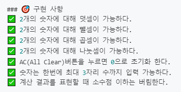

우테코 크루인 하루의 블로그 글을 보면서 리뷰정리를 잘 해둔 것을 보았다.
나도 매번 리뷰 기회를 소중히 살려보고 싶어 리뷰를 정리해보았다.

## 계산기 미션 
https://github.com/woowacourse/javascript-calculator

### 공통 피드백 정리

#### 1. 주석에 담아야할 내용
  - 설명: 다른 사용자가 높은 이해를 할 수 있도록 작성가능
    - ex) 이 데이터에서 이진트리는 해시테이블보다 40%정도 빠르다.
    - ex) 재귀함수를 이용하면, 기존의 100line이 될수 있는 코드가 단 20줄로 정리된다. 반면 성능은 유의미한 차이가 없다.

  - 코드의 결함: 결함을 드러내고 수정의 여지를 남김
    - ex) TODO: JPEG외 다른 이미지 포맷도 처리할 수 있어야 한다
    - ex) [실제 React 코드에 포함된 주석](https://github.com/facebook/react/blob/master/packages/react-is/src/ReactIs.js)
        ```js
        // AsyncMode should be deprecated
        export function isAsyncMode(object: any) {
          if (__DEV__) {
            if (!hasWarnedAboutDeprecatedIsAsyncMode) {
              hasWarnedAboutDeprecatedIsAsyncMode = true;
              // Using console['warn'] to evade Babel and ESLint
              console['warn'](
                'The ReactIs.isAsyncMode() alias has been deprecated, ' +
                  'and will be removed in React 18+.',
              );
            }
          }
          return false;
        }
        ```

  - 상수에 대한 설명: 왜 특정한 값을 갖게 되는지에 대한 이해를 시킬 수 있음
    - ex) 
      ```js
      // 합리적인 한계 - 1000개 이상을 구독하는 사람은 기획 논의상 없다.
      const MAX_SUBSCRIPTIONS = 1000
      ```
      ```js
      // 사용자들은 0.72가 크기/해당도 대비 최선이라고 생각한다.
      const IMAGE_QUALITY = 0.72
      ```

#### 2. 임시 변수 줄이기

- ex)
  ```js
  const year = new Date().getFullYear()
  message.lastVistedYear = year
  ```
  이미 new Date().getFullYear()이라는 메서드의 네이밍에서 명확한 의미를 가지고 있다. + 한번만 사용된다.

#### 3. 변수는 좁은 곳에 쓰자
  네임스페이스 관리에 좋다.(이름 중복, side effects)
  코드를 읽는 사람이 생각해야 하는 변수 수를 줄여준다.

- let 대신 const 쓰기
  변수 값을 추적하는 일은 어렵다.

#### 4. 네이밍은 작은 설명이다.

#### 5. 숫자는 이름이 아니다
  index로 접근하는 것 피하기

#### 6. 재사용은 의미를 더 명확하게 만들어준다.

#### 7. 기타
  - className에 대한 비교
  classList를 이용하여 비교하기
  - 함수 매개변수 갯수
  매개변수가 많아지면 여러가지 일을 할 가능성이 있다.
  매개변수가 적을수록 함수가 더 명확하고, 실수 가능성이 낮아진다.
  - if 문 중괄호 사용하기
  - 구현한 요구사항 체크해서 PR메시지 또는 README파일에 담아서 제출하기
  
  
  - 원격 저장소 push할 것과 말아야할 것 구분하기
  - 예외상황 고려, 엣지 케이스
  - 랜덤값에 대한 테스트 고민
    테스트 가능한 코드와 힘든 부분을 분리하기
    ```js
    const FORWARD_NUM = 4

    const getRandomNumber = () => {
      return Math.floor(Math.random() * 10)
    }

    function Car() {
      this.poistion = 0

      this.move = () => {
        if (getRandomNumber() >= FORWARD_NUM) {
          this.position++
        }
      }
    }
    ```
    move에 진행되는 숫자 값이 달라지는데 이부분을 리팩토링을 아래처럼 할 수 있다.
    ```js
    function Car() {
      this.poistion = 0

      this.move = (number) => {
        if (number >= FORWARD_NUM) {
          this.position++
        }
      }
    }
    ```


### 느낀점
수업을 처음 시작할 때에 내 첫 생각은 `주석은 달지 않아야 한다.` 였다.
하지만 예시들과 오픈소스에서 사용되는 것을 보면서 좋은 주석의 사례들을 알수 있었다.
코드는 혼자만 보는 것이 아니기 때문에 다른 사람들에게 도움을 줄 수 있을것이다.

공통 피드백 내용에는 없지만 순수함수를 사용함으로써 어떤 동작을 하는지 보장할 수 있음을 알수 있었다.
네이밍에 대한 피드백에서는 `함수 네이밍` 뿐만아니라, `변수`, `api`자체도 네이밍으로 이해를 도울 수 있다는 점을 깨달앗다.

추가적으로 parseInt는 기본 10진법으로 바꾸는 api가 아니다. 차라리 Number()를 이용하자.
